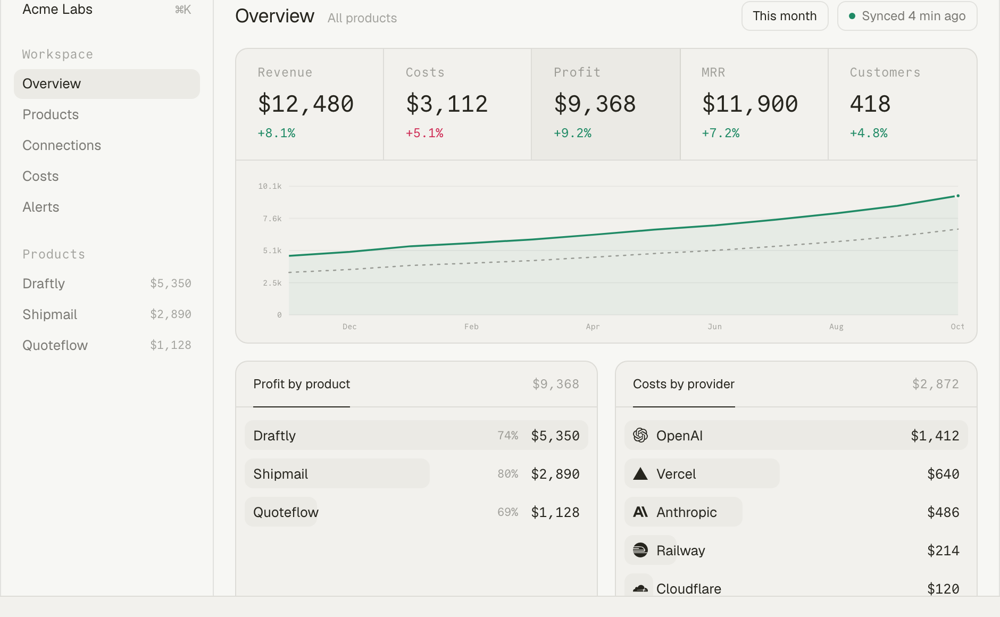

<div align="center">

<a href="https://openprofit.dev"></a>

### Finance for developers

[Website](https://openprofit.dev) · [Docs](https://openprofit.dev/docs) · [Self-host](https://openprofit.dev/docs/self-host) · [Connectors](https://openprofit.dev/docs/connectors) · [Issues](https://github.com/lobbystack/openprofit/issues)

[](https://github.com/lobbystack/openprofit/actions/workflows/check.yml)
[](LICENSE)
[](https://github.com/lobbystack/openprofit/pkgs/container/openprofit)
[](https://github.com/lobbystack/openprofit)

</div>

## About OpenProfit

OpenProfit is the open-source finance dashboard for people who build software. It pulls your revenue and your costs from the services you already use, assigns them to the products you run, and shows you the numbers that matter: what each product brings in, what it costs to run, what is left, and which way it is going.

It exists because that view does not exist anywhere else. Revenue lives in your payment processor. Costs live in a dozen billing pages: AI providers, hosting, databases, email, domains. Each one shows its own slice, in its own currency, on its own calendar. Adding them up is a spreadsheet you update twice and abandon.

## One view of your business

- **Revenue, wherever it comes from.** Payment processors today, app stores and marketplaces next. Net of fees and refunds, with MRR and active customers alongside.
- **Costs, pulled automatically.** AI providers, hosting, infrastructure, usage-based services. Read from their billing APIs down to the project or workspace that incurred them. Anything without an API goes in as a flat monthly or yearly amount.
- **Products as the unit.** An OpenAI project, a Vercel project, a Railway service, a Cloudflare zone: each maps to one of your products. Costs land where they belong, so you see margin per product, not just a total.
- **One currency, one calendar.** Every line converts to your base currency at that day's European Central Bank rate. Pick a period and compare it with the one before.
- **Signals, not noise.** Alerts when a cost doubles, a margin drops under a floor, or a sync fails. A weekly email with the three numbers and the biggest mover.
- **Build in public, if you want.** A public page per product with full numbers, revenue only, or percentages. Your call.
- **Yours to run.** MIT licensed. One container to self-host, or the hosted version with nothing to operate.

<p align="center">
  
</p>

## Key features

- **Overview** with revenue, costs, profit, MRR and customers for any period, deltas against the previous one, and a twelve-month chart with last year as a reference line.
- **Breakdowns** by product, by revenue source and by cost provider.
- **Connectors** that take a read-only key, test it before saving, and store it encrypted. Two years of history on the first sync, incremental after that.
- **Product mapping** per provider sub-unit, with a shared bucket for anything unassigned.
- **Flat costs** for subscriptions, domains and anything without an API.
- **Multi-currency** workspaces with daily rates and a base currency you can change later.
- **Alerts** for cost spikes, margin floors and sync failures.
- **Weekly email** with last week against the week before.
- **Public pages** per product, server-rendered from the same data.
- **Dark mode**, keyboard search, and a layout that holds on a phone.
- **Self-hosting** in one container with Postgres built in, or a `postgres://` URL to your own.
- **Sign in** with email, GitHub or Google.

## Connectors

| Provider | Kind | What it reads |
| --- | --- | --- |
| Stripe | Revenue | Balance transactions, active subscriptions, MRR, customers |
| Polar | Revenue | Daily revenue and net revenue, MRR, active subscriptions |
| OpenAI | Cost | Daily cost by project and line item |
| Anthropic | Cost | Daily cost by workspace |
| Vercel | Cost | Daily charges per project |
| Cloudflare | Cost | Billable usage, or invoices as fallback |
| Railway | Cost | Monthly usage per project at published rates |
| Flat costs | Cost | Any monthly or yearly amount, typed in |

Paddle, Lemon Squeezy, App Store, Google Play, Supabase and Resend are next. A connector is one file in [`src/connectors`](src/connectors) that implements `verify` and `fetchRevenue` or `fetchCosts`. If you want one that is not here, [open an issue](https://github.com/lobbystack/openprofit/issues) with a link to the provider's billing API, or send a pull request.

## Getting started

The quickest way is the hosted version at [openprofit.dev](https://openprofit.dev). Sign in, create a workspace, connect one revenue source and one cost source, and the overview fills in. Free under $2,500 MRR; paid plans add faster syncs, and every connector is in every plan.

## Self-hosting

One container. Data lives in an embedded Postgres on a volume, so there is nothing else to run.

```bash
docker run -d \
  --name openprofit \
  -p 3000:3000 \
  -v openprofit_data:/app/data \
  -e SECRET_KEY=$(node -e "console.log(require('crypto').randomBytes(32).toString('base64'))") \
  -e APP_URL=http://localhost:3000 \
  ghcr.io/lobbystack/openprofit:latest
```

Open http://localhost:3000/login and enter your email. Without an email provider the sign-in link prints in `docker logs openprofit`. Set `RESEND_API_KEY` and `EMAIL_FROM` to send it by mail. Point `DATABASE_URL` at a `postgres://` server to use your own database.

The [self-host guide](https://openprofit.dev/docs/self-host) covers updates and Railway. The [environment reference](https://openprofit.dev/docs/environment) lists every variable.

## How it works

One TanStack Start app serves the landing page, the docs and the dashboard. A scheduler inside the server pulls each connection on its cadence, converts amounts to the workspace's base currency, and upserts lines by the provider's own ids, so re-running a range never double-counts. The overview is grouped sums over those lines.

```
src/connectors/   one file per provider: verify, fetchRevenue, fetchCosts, fetchSnapshots
src/server/       sync runner, FX rates, alerts, weekly email, billing, server functions
src/routes/       landing, docs, app pages, API routes
src/db/           Drizzle schema for Postgres; migrations in ./drizzle
```

Postgres everywhere: PGlite embedded for self-host and local development, a Postgres server for the hosted version. Auth is Better Auth. Styling is Tailwind.

## Development

Node 22 and pnpm.

```bash
pnpm install
cp .env.example .env    # set SECRET_KEY
pnpm db:seed            # a demo workspace with a year of numbers
pnpm dev
```

Sign in once at http://localhost:3000/login, then attach the demo workspace to your user:

```bash
pnpm db:seed --owner=you@example.com
```

Checks: `pnpm check` (Biome), `npx tsc --noEmit`, `pnpm build`. After a schema change, `pnpm db:generate` writes a migration; migrations run when the server starts.

## Contributing

Issues and pull requests are welcome. Connectors are the most useful contribution: copy [`src/connectors/polar.ts`](src/connectors/polar.ts), implement it against the provider's API, and register it in [`src/connectors/index.ts`](src/connectors/index.ts).

Found a security problem? Email hello@openprofit.dev rather than opening an issue.

## License

[MIT](LICENSE). The hosted version at openprofit.dev is operated by Lobbystack Inc.
