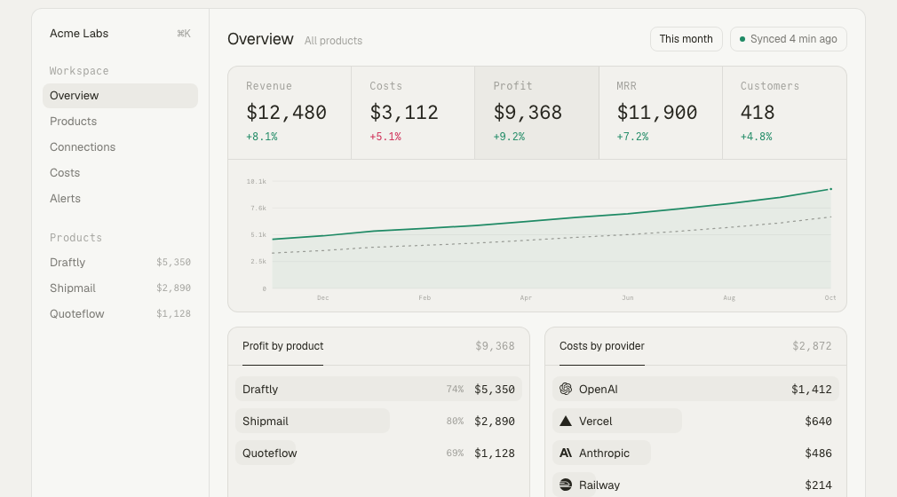

<p align="center">
  <a href="https://openprofit.dev"></a>
</p>

<h1 align="center">OpenProfit</h1>

<p align="center">Finance for developers. Every product you run, its revenue, its costs and what is left, on one page.</p>

<p align="center">
  <a href="https://openprofit.dev">Hosted version</a> ·
  <a href="https://openprofit.dev/docs/self-host">Self-host</a> ·
  <a href="https://openprofit.dev/docs/connectors">Connectors</a> ·
  <a href="https://github.com/lobbystack/openprofit/issues">Issues</a>
</p>

<p align="center">
  <a href="https://github.com/lobbystack/openprofit/actions/workflows/check.yml"></a>
  <a href="LICENSE"></a>
  <a href="https://github.com/lobbystack/openprofit/pkgs/container/openprofit"></a>
</p>

## What it is

You ship software. Money comes in through Stripe or Polar. Money goes out to OpenAI, Anthropic, Vercel, Cloudflare, Railway and a dozen subscriptions. Each dashboard shows its own slice, and nobody adds them up.

OpenProfit adds them up. Connect the accounts, assign each cost to a product, and you get one view: how much each product makes, what it costs to run, the margin, and how that moved since last month.

- **Revenue** from Stripe and Polar, net of fees and refunds, with MRR and active customers.
- **Costs** from the services you pay for, pulled from their billing APIs, down to the OpenAI project or Vercel project that caused them.
- **Products** as the unit. Costs land on the product that generated them, or in a shared bucket until you assign them.
- **One currency.** Everything converts to your base currency at that day's European Central Bank rate.
- **Alerts** when a cost doubles, a margin drops, or a sync fails.
- **Weekly email** with the three numbers and the biggest mover.
- **Public pages** per product, if you want to build in public.
- **Self-host** in one container, or use the hosted version.

## Connectors

| Provider | What it reads | Status |
| --- | --- | --- |
| Stripe | Balance transactions, active subscriptions | Ready |
| Polar | Daily revenue, MRR, active subscriptions | Verified live |
| OpenAI | Daily cost by project and line item | Verified live |
| Anthropic | Daily cost by workspace | Ready |
| Vercel | Daily charges per project | Ready |
| Cloudflare | Billable usage, or invoices as fallback | Ready |
| Railway | Monthly usage per project at published rates | Ready |
| Anything else | Flat monthly or yearly amount, typed in | |

"Ready" means written against the provider's documented API and waiting for a live account to confirm it. Each connector takes a read-only key you create in the provider's dashboard. The connect page links to the right settings page, lists the permissions to tick, and tests the key before saving. Keys are stored encrypted.

Want a connector that is not here? [Open an issue](https://github.com/lobbystack/openprofit/issues) with the provider and a link to its billing API. A connector is one file in [`src/connectors`](src/connectors).

## Run it

### Hosted

[openprofit.dev](https://openprofit.dev). Free under $2,500 MRR. Paid plans add faster syncs; every connector is in every plan.

### Self-host

One container. Data lives in an embedded Postgres on a volume.

```bash
docker run -d \
  --name openprofit \
  -p 3000:3000 \
  -v openprofit_data:/app/data \
  -e SECRET_KEY=$(node -e "console.log(require('crypto').randomBytes(32).toString('base64'))") \
  -e APP_URL=http://localhost:3000 \
  ghcr.io/lobbystack/openprofit:latest
```

Open http://localhost:3000/login and enter your email. Without an email provider, the sign-in link prints in `docker logs openprofit`. Set `RESEND_API_KEY` and `EMAIL_FROM` to send it by mail, and point `DATABASE_URL` at a `postgres://` server if you have one.

Full list of variables in the [docs](https://openprofit.dev/docs/environment).

## How it works

One TanStack Start app serves the landing page, the docs and the dashboard. A scheduler inside the server pulls each connection on its cadence, converts amounts to the workspace's base currency, and upserts lines by the provider's own ids, so re-running a range is safe. The overview is a handful of grouped sums over those lines.

```
src/connectors/   one file per provider: verify, fetchRevenue, fetchCosts, fetchSnapshots
src/server/       sync runner, FX, alerts, weekly email, billing, server functions
src/routes/       landing, docs, app pages, API routes
src/db/           Drizzle schema (Postgres), migrations in ./drizzle
```

Postgres everywhere: PGlite embedded for self-host and local dev, a Postgres server for the hosted version. Auth is Better Auth with magic links, GitHub and Google.

## Develop

Node 22 and pnpm.

```bash
pnpm install
cp .env.example .env    # set SECRET_KEY
pnpm db:seed            # a demo workspace with a year of numbers
pnpm dev
```

After signing in once at http://localhost:3000/login, attach the demo workspace to your user:

```bash
pnpm db:seed --owner=you@example.com
```

Checks: `pnpm check` (Biome), `npx tsc --noEmit`, `pnpm build`.

Schema changes: edit `src/db/schema.ts`, then `pnpm db:generate`. Migrations run when the server starts.

## Contributing

Issues and pull requests are welcome. Connectors are the most useful thing to add: copy [`src/connectors/polar.ts`](src/connectors/polar.ts), implement `verify` and `fetchRevenue` or `fetchCosts`, and register it in [`src/connectors/index.ts`](src/connectors/index.ts).

## License

[MIT](LICENSE). The hosted version at openprofit.dev is run by Lobbystack Inc.
